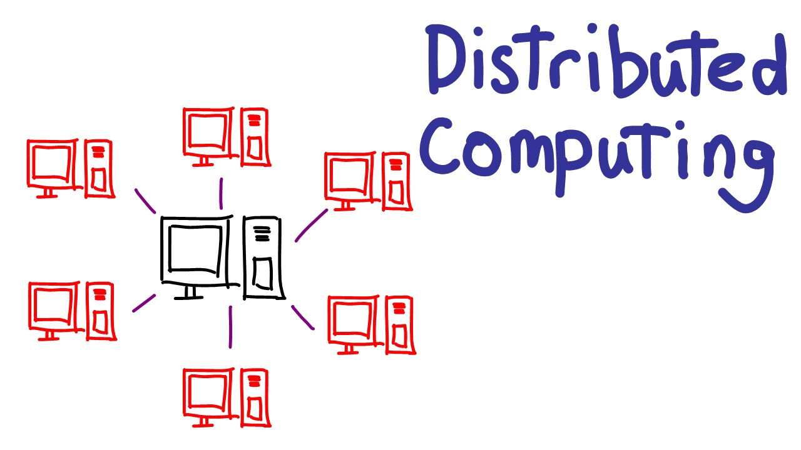

# Распределенные системы

## Что такое Распределенные системы?

Для наших целей достаточно дать такое достаточно широкое определение:

> Распределенная система представляет собой совокупность автономных вычислительных элементов и является для его пользователей единой связанной системой
[Maarten van Steen, Andrew S. Tanenbaum, Distributed Systems](https://www.distributed-systems.net/index.php/books/ds3/)

Особенность:
- Совокупность вычислительных элементов (Узел, нода, процесс), каждый из которых в состоянии работать независимо от других.
- Пользователи считают, что они имеют дело с единой системой. Это значит, что автономные узлы должны сотрудничать, общаться.

---

С **аппаратной точки зрения**: совокупность автономных узлов, связанных сетью:
- Функционируют независимо, нет привычных разделяемых ресурсов (часы, память)
- Могут быть географически распределены, иметь различные характеристики
- Подвержены частичным отказам, как и сеть между ними

С **программной точки зрения**: совокупность независимых процессов взамодействующих посредством передачи сообщений
- Процессы выполняются на разных узлах
- Каждый процесс имеет собственное состояние
- Процессы не имеют прямого доступа к состояниям других процессов
- Сообщения могут теряться, изменять порядок и дублироваться

![[pictures/processes.png]]

---
## Зачем нужны распределенные системы?
- Увеличение производительности:
	- Решение сложных задач (расчёты, моделирование, обучение моделей)
	- Хранение и обработка большого объёма данных 
	- Обслуживание большого кол-ва клиентов (Web Service, High Load)
- Повышение отказоустойчивости и доступности:
	- Устойчивость к отказам за счёт избыточности  
- Совместное использование ресурсов:
	- Клиент - Сервер, peer-to-peer, вычислительный кластер
	- Поддерживать единою систему дешевле, чем множество независимых
- Коммуникация и координация:
	- Пользователи и узлы географически распределены 
- Уменьшение задержки при обслуживании географических распределенных пользователей
	- Размещение данных как можно ближе к месту использования (Data Locality)

![[peer_to_peer.png]]
--- 
## Примеры распределенных систем

- Email, обмен сообщениями
- Веб-поиск
- Социальные сети
- Онлайн игры
- Онлайн редактор документов (Google Docs)
- Хранилище данных (DWH, Data Lake) 
- Интернет-банк 
- Облачные системы (AWS, Azure, GC, Yandex Cloud)
- Сеть доставки контента (CDN)
- Грид - системы (Вычислительные кластера)
- Файлообменник, блокчейн, онлайн-кинотеатр
- Веб приложения

---
## Нефункциональные требования 
Базовые свойства которыми должна обладать распределенная система

- Производительность
- Масштабируемость
- Надежность
- Доступность
- Отказоустойчивость
- Безопасность
- Согласованность
- Прозрачность
- Открытость
- Удобство сопровождения 

Рассмотрим подробно каждое из них:

---
## Производительность (Performance)
- Основные показатели:
	- Время ожидания, задержка (Latency); время обслуживания запроса (service time), время отклика (response time). 
	- Пропускная способность (Throughput), число обрабатываемых запросов/данных в секунду.
	- Качество обслуживания, битрейт (степень сжатия потока), доля пропущенных кадров потокового видео.
	
- В каждой системе могут быть свои приоритеты по требованиям

---

## Как оценить производительность?

В зависимости от типа операции или источника обращения к данным, задержка и пропускная способность различается.
Доступ к памяти, идёт быстрее, чем к жестким дискам. 
Запрос в рамках одного data центра более производителен, чем доступ между дата центрами.

![[table_latency_throughtput.png]]

[Numbers Every Programmer Should Know By Year (colin-scott.github.io)](https://colin-scott.github.io/personal_website/research/interactive_latency.html)

---
## Как измерить производительность?

Довольно часто смотрят именно на среднее время отклика (арифметическое среднее: при n значениях сложить их все и разделить на n.). 

Однако среднее значение далеко не лучшая метрика для случаев, когда нужно знать «типичное» время отклика, поскольку оно ничего не говорит о том, у какого количества пользователей фактически была такая задержка. 

Обычно удобнее применять процентили. Если отсортировать список времен отклика по возрастанию, то медиана — средняя точка: например, медианное время отклика, равное 200 мс, означает, что ответы на половину запросов возвращаются менее чем через 200 мс, а половина запросов занимает более длительное время.

![[Response_time.png]]

Это делает медиану отличной метрикой, когда нужно узнать, сколько пользователям обычно приходится ждать: половина запросов пользователя обслуживается за время отклика меньше медианного, а оставшиеся обслуживаются более длительное время. Медиана также называется 50-м процентилем, который иногда обозначают p50.

Чтобы выяснить, насколько плохи аномальные значения, можно обратить внимание на более высокие процентили: часто применяются 95-й, 99-й и 99.9-й (сокращенно обозначаемые p95, p99 и p999). Это пороговые значения времени отклика, для которых 95 %, 99 % или 99,9 % запросов выполняются быстрее соответствующего порогового значения времени. 

Например, то, что время отклика для 95-го процентиля равно 1,5 с, означает следующее: 95 из 100 запросов занимают менее 1,5 с, а 5 из 100 занимают 1,5 с либо дольше.

Например, процентили часто используются в требованиях к уровню предоставления сервиса (service level objectives, SLO) и соглашениях об уровне предоставления сервиса (service level agreements, SLA) — контрактах, описывающих ожидаемые производительность и доступность сервиса. 
В SLA, например, может быть указано: сервис рассматривается как функционирующий нормально, если его медианное время отклика менее 200 мс, а 99-й процентиль меньше 1 с (когда время отклика больше, это равносильно неработающему сервису), причем в требованиях может быть указано, что сервис должен работать нормально не менее 99,9 % времени.

Таким образом, производительность должна быть предсказуемой и лежать в допустимом интервале.

---

## Масштабируемость (Scalability)

Способность системы "расти" в некотором измерении без потери производительности и других характеристик, а так же без необходимости изменять программную реализацию.
- Возможные измерения: число узлов, пользователей, запросов, организаций, территория развертывания
- Разновидности: нагрузочная, географическая, административная

### Нагрузочная масштабируемость 
Способность системы увеличивать свою производительность при увеличении нагрузки путем замены или добавления аппаратных средств 

Параметры, описывающие нагрузку: 
• Число запросов в секунду 
• Число активных пользователей 
• Соотношение операций чтения и записи 

Подходы:
• вертикальное масштабирование (scale up)
• горизонтальное масштабирование (scale out)

На практике хорошая архитектура обычно представляет собой прагматичную смесь этих подходов: например, может оказаться проще и дешевле использовать несколько весьма мощных компьютеров, чем много маленьких виртуальных машин.

---
## Узкие места

• Централизованные компоненты:
	- Вычислительный сервис (CPU-bound) 
	- Поисковый сервис (I/O-bound) 
	- Видео по запросу (сетевой канал) 
- Накладные расходы на взаимодействия 
- Пропускная способность сети 
- Системное и промежуточное ПО 

В целом чем больше система, тем сложнее ее масштабировать

---
## Эластичность

Автоматическое масштабирование ресурсов под текущую нагрузку 

Некоторые системы способны адаптироваться, то есть умеют автоматически добавлять вычислительные ресурсы при обнаружении прироста нагрузки, в то время как другие системы необходимо масштабировать вручную (человек анализирует производительность и решает, нужно ли добавить в систему дополнительные машины). 

Способные к адаптации системы полезны в случае непредсказуемого характера нагрузки, но масштабируемые вручную системы проще и доставляют меньше не ожиданностей при эксплуатации.

---
## Географическая масштабируемость 

Способность системы сохранять требуемых характеристики (например, производительность) при территориальном разнесении её компонентов.

![[network.png]]

[Submarine Cable Map](https://www.submarinecablemap.com/)

![[ping_table.png]]
[Global Ping Statistics - WonderNetwork](https://wondernetwork.com/pings)

---
## Content Delivery Network (CDN)
![[example_cdn.png]]
В качестве решения может быть использован CDN, когда запросы от пользователей идут не напрямую к оригинальному источнику, а на CDN узлы, которые распространены по географическим локациям. За счёт этого, доступ к нужным ресурсом происходит быстрее. 

---
## Административная машстабируемость

Возможность системы функционировать на базе произвольного количества независимых владельцев, обслуживающих части системы и предоставляющих ресурсы в рамках системы 

Примеры: peer-to-peer, файлообменные сети, Биткойн, IPFS, грид-инфраструктуры

![[types_of_network.jpeg]]

---
## Надежность (Reliability)

Способность системы сохранять работоспособное состояние (не отказывать) в течение некоторого промежутка времени:
- приложение выполняет ожидаемую пользователем функцию;
- оно способно выдержать ошибочные действия пользователя или применение программного обеспечения неожиданным образом; 
- его производительность достаточно высока для текущего сценария использования, при предполагаемой нагрузке и объеме данных; 
- система предотвращает любой несанкционированный доступ и неправильную эксплуатацию

![[time_between_failures.png]]

• Характеризуется с помощью средней продолжительности работы между отказами (mean time between failures, MTBF)

---
## Причины отказов?

Обратите внимание, что сбой (fault) и отказ (failure) — разные вещи. 

Сбой обычно определяется как отклонение одного из компонентов системы от рабочих характеристик, в то время как отказ — ситуация, когда вся система в целом прекращает предоставление требуемого сервиса пользователю.

- Аппаратные сбои
- Программные ошибки
- Человеческий фактор

---
### Доступность (Availability)
Система доступна, когда пользователи могут взаимодействовать с системой, получать требуемые сервисы, корректные ответы и т.д. 

• Доступность часто измеряется как процент времени, когда система доступна
• Причины недоступности: отказы, ошибки, обновление ПО, технические работы... 
• Время восстановления после отказов (mean time to repair, MTTR) 
• Availability = (1 - MTTR/MTBF) * 100%

![[availability.png]]

[Achieving “five nines” in the cloud for justice and public safety | AWS Public Sector Blog (amazon.com)](https://aws.amazon.com/ru/blogs/publicsector/achieving-five-nines-cloud-justice-public-safety/)

---
### Отказоустойчивость (Fault-Tolerance)

Способность системы продолжать нормально функционировать после отказа одного или нескольких её компонентов

• Подразумевает 100% доступность, обходится дороже высокой доступности 
• Имеет определенные пределы (например, отказ менее половины узлов)

![[fault_tolearance.png]]
Источник [https://habr.com/ru/company/vk/blog/683192/](https://habr.com/ru/company/vk/blog/683192/)

---
## Обеспечение отказоустойчивости:

- Исключение единых точек отказа (single points of failure)
- Избыточность на аппаратном уровне, репликация состояния 
- Обнаружение и обработка отказов на программном уровне
- Восстановление отказавших компонентов 
- Прогнозирование и предотвращение отказов

---
## Особенности отказов в РС 

Процесс А отправил запрос процессу B, но не получил ответа 
Что это значит? 
- Запрос потерялся и не дошел до B 
- Запрос дошел до B, но B пока не успел его обработать 
- Запрос дошел до B, но B упал, не успев обработать его 
- Запрос дошел до B, но B его просто проигнорировал 
- Запрос дошел до B и был обработан, но ответ пока не дошел до A 
- Запрос дошел до B и был обработан, но ответ потерялся при доставке 

Нельзя отличить отказ сети от отказа узла или процесса

---
## Безопасность

- Предотвращение возможных угроз 
	- Утечка, фальсификация, вандализм... 
• Защита от атак
	- Подслушивание, подмена, повтор, DDoS... 
• Базовые требования 
	- Конфиденциальность 
	- Целостность 
	- Аутентификация 
	- Невозможность отказа 
	- Авторизация

---
## Согласованность (Consistency)
Модель согласованности определяет гарантии, которые система дает клиентам на операции с хранимыми в ней данными 

• Пример: при чтении записи из базы всегда возвращается последнее записанное значение 
• Как обеспечить если в системе есть несколько реплик данных и одновременно работающих клиентов? 
• Чем сильнее гарантии согласованности, тем сложнее и дороже их обеспечивать • Компромисс между согласованностью и доступностью (CAP теорема)

![[cap.png]]
---
### Прозрачность

Способность системы скрывать от пользователей и приложений свою распределенную природу, то есть делать "прозрачным" физическое распределение процессов и ресурсов 

• Прозрачность доступа, местоположения, репликации, одновременного доступа, отказов, масштабирования ...
• Обеспечить полную прозрачность (иллюзию работы с локальной системой) крайне сложно 
• Стоит ли скрывать распределенность системы?

---
### Открытость

Система реализует открытые спецификации интерфейсов, протоколов, форматов данных и т.д. 

Открытая спецификация 
	• общедоступна, не принадлежит производителю 
	• не зависит от конкретных технических и программных средств или продуктов • поддерживается открытым процессом, под контролем общественного мнения 

Преимущества:
	• Переносимость прикладного ПО 
	• Поддержка нескольких независимых реализаций 
	• Способность взаимодействия с другими приложениями и системами 
	• Легкая миграция пользователей от системы к системе

---
### Удобство сопровождения (Maintainability)

- Есть ли удобный мониторинг системы и подробное логирование? 
- Насколько быстро можно диагностировать и устранить проблему? 
- Можно ли выполнять обновления системы без downtime? 
- Можно ли отключить часть машин и продолжать работать? 
- Насколько быстро система восстанавливается после полной остановки?
- Насколько легко можно проводить расширение системы? 
- Насколько легко понять как устроена и работает система? 
- Можно ли адаптировать систему под меняющиеся требования?

---
## Реализация распределенных систем

> Distributed systems need radically different software than centralized systems do. A. Tannenbaum

Особенности:
• ~~Классический~~ Распределенный алгоритм 
• ~~Последовательное~~ Параллельное исполнение (concurrency) 
• ~~Полная~~ Частичная информация (нет глобальных часов) 
• ~~Отсутствуют~~ Присутствуют независимые отказы частей системы 
• Сложность ~~C(Кол-во операций)~~ C(Кол-во операций, Кол-во коммуникаций)

![[8_issues.png]]
Источник: https://deniseyu.io/art

Ошибочные допущения при разработке распределенных систем:
1. Сеть надежна
2. Latency (Задержка) нулевая
3. Пропускная способность бесконечна
4. Топология не изменяется
5. Существует только один администратор
6. Транспортные расходы нулевые
7. Сеть однородна

---
## Distributed Computing 

• Раздел компьютерных наук, изучающий распределенные системы:
	-  Теоретические модели РС, типовые задачи, распределенные алгоритмы 

• Применение распределенных систем для решения трудоемких вычислительных задач 
	- Разновидность параллельных вычислений

---
## Типовые задачи 

• Взаимодействие между процессами (в паре или группе) 
• Обнаружение отказов и учёт участников 
• Именование, поиск и распространение информации 
• Масштабирование и балансировка нагрузки 
• Организация параллельной обработки запросов и данных 
• Репликация данных и обеспечение согласованности 
• Упорядочивание событий и обнаружение конфликтов 
• Координация процессов (взаимное исключение, выборы лидера, консенсус)
• Обеспечение безопасности и устойчивости к произвольным отказам

---
## Материалы

• van Steen M., Tanenbaum A.S. Distributed Systems: Principles and Paradigms. (глава 1)
• Kleppmann M. Designing Data-Intensive Applications. (глава 1)
- ...

