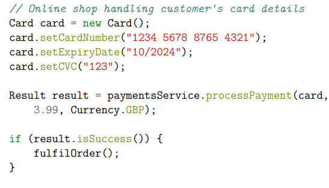

# Взаимодействие между процессами в РС

## Введение

Взаимодействие между процессами лежит в основе всех распределенных систем (РС). 

Поэтому крайне важно рассмотреть способы, через которые процессы на разных машинах могут обмениваться информацией.

Для большинства распределенных систем, наименьший уровень интерфейса - это cетевой уровень (Network Layer) по эталонной модели OSI (Open Systems Interconnection Reference Model).

---

## Обмен сообщениями (Message passing)

•Наиболее общая и универсальная модель взаимодействия процессов в РС

•Сообщения передаются по ненадежным каналам (Интернет, Network)

•Реализация может предоставлять некоторые гарантии по доставке сообщений (например, доставка хотя бы одного сообщения)

•Возможны различные варианты и схемы взаимодействий

---

## Варианты взаимодействий
Чтобы понять какие варианты взаимодействий могут быть, нужно ответить на следующие вопросы:

•Сколько процессов взаимодействует?

•В каких направлениях передаются сообщения?

•Требуется ли ответ от получателя?

•Кто инициирует передачу сообщения?

•Должны ли отправитель и получатель "знать" друг друга?

•Должны ли процессы работать одновременно?

•Блокируются ли процессы во время отправки/приема сообщений?

Далее разберём подробнее.

---

### Число процессов

Кол-во процессов между которыми идёт взаимодействие.

•Парные взаимодействия (Два процесса, клиент-сервер)

•Групповые взаимодействия (Несколько процессов, например как: [Gossip Protocol](https://ru.wikipedia.org/wiki/Gossip_(%D0%BF%D1%80%D0%BE%D1%82%D0%BE%D0%BA%D0%BE%D0%BB)))

---

### Направления передачи сообщений

- В одну сторону (unidirectional):
	- роли отправителей и получателей зафиксированы
	- пример: издатель-подписчик (publisher-subscribers, примеры Kafka, RabbitMQ)

- В обе стороны (bidirectional):
	- процесс может быть как отправителем, так и получателем
	- пример: клиент-сервер (client-server)

---

### Требуется ли ответ от получателя?

- Отправка в одну сторону (one-way, например UDP протокол)

- Схема "запрос-ответ" (request-reply, например TCP протокол)

---

### Кто инициирует передачу сообщения?

- Push - отправитель инициирует доставку, пример таких систем RabbitMQ:
	- получатель пассивен

- Pull - получатель инициирует доставку, пример таких систем Kafka:
	- отправитель пассивен

---

### Связывание процессов

В распределенной системе, процессы могут быть зависимые друг от друга, например:

- Связывание по пространству (space coupling):
	- Процессы должны обладать информацией друг о друге
	- Например, отправитель должен знать адрес получателя

- Связывание по времени (time coupling):
	- Процессы должны выполняться в одно время
	- Transient vs persistent communication

#### Persistent communication
Система электронной почты является типичным примером, в котором взаимодействие (communication) является **постоянным**.
При постоянной связи (**persistent communication**) сообщение, которое было передано для передачи, сохраняется связующим программным обеспечением (промежуточное место для хранения) до тех пор, пока оно доставляется получателю.
В этом случае промежуточное программное обеспечение будет хранить сообщение в одном или нескольких хранилищах.
Как следствие отправляющему приложению нет необходимости продолжать выполнение после отправки сообщения. Аналогично приложение-получатель не должно выполняться при отправке сообщения.

### Transient communication
Напротив, при перехóдной (врéменной) связи (**transient communication**) сообщение сохраняется системой связи только до тех пор, пока выполняется отправляющее и получающее приложения. 
Если процесс не может доставить сообщение за-за прерывания передачи или из-за того, что получатель в данный момент не активен, сообщение будет просто сброшено.

---

### Непрямое взаимодействие (indirect)

- Происходит через некоторого посредника или абстракцию, без прямого связывания между отправителями и получателями

Примеры:
- Очередь сообщений
- Издатель-подписчик (publisher-subscriber)
- Общая память

---

### Блокируются ли процессы?

Cвязь может быть синхронной или асинхронной.

- Синхронное взаимодействие:
	- отправитель блокируется (до приема сообщения к доставке, доставки сообщения, окончания обработки сообщения...)
	- получатель блокируется до приема сообщения

- Асинхронное взаимодействие:
	- отправитель продолжает выполнение сразу после отправки сообщения
	- получатель может неблокирующим образом проверить наличие сообщений
	- позволяет перекрыть коммуникации и вычисления

Характерной особенностью асинхронной связи является то, что отправитель продолжает работу сразу после того, как он отправил свое сообщение для передачи. Это означает, что сообщение (временно) сохраняется промежуточным программным обеспечением после отправки. 

При синхронной связи отправитель блокируется до тех пор, пока известно, что его запрос не принят. По сути, есть три момента, где может иметь место синхронизация. 
1) отправитель может быть заблокирован до тех пор, пока промежуточное программное обеспечение не сообщит, что оно примет на себя передачу запроса. 
2) отправитель может синхронизироваться до тех пор, пока его запрос не будет доставлен предполагаемому получателю. 
3) синхронизация может иметь место, позволяя отправителю подождать, пока его запрос не будет полностью обработан, то есть до момента, когда получатель вернет ответ. 

---

### Возможные гарантии транспорта

**Контроль целостности сообщений** 
Целостность информации - означает, что данные не были изменены при выполнении какой-либо операции над ними, будь то передача, хранение или отображение.

Например: Проверка контрольных сумм (checksum)

- Доставка сообщения:
	- возможно будет доставлено, возможно несколько раз (zero or more, best effort)
	- будет доставлено не более 1 раза (at most once), риск потерять сообщение
	- будет доставлено как минимум 1 раз (at least once), сообщение не потеряем, но возможно получить несколько раз (дубли)
	- будет доставлено ровно 1 раз (exactly once)

- Порядок доставки сообщений:
	- в произвольном порядке
	- в порядке их отправки

[achieving-exactly-once-message-processing-with-ably](https://ably.com/blog/achieving-exactly-once-message-processing-with-ably#types-of-messaging-semantics)

---

## Взаимодействие, Клиент - Сервер, Web:

Есть два процесса, клиент и сервер

Клиент отправляет HTTP GET запрос на получение ресурса от сервера

Сервер отправляет в ответе HTML страницу:

---

## Клиент - Cервер: Online Payments example

Другой пример клиент-серверного взаимодействия с обработкой онлайн платежей, когда вы покупаете что-то в онлайн магазине используя карту. 
Вы вводите свой номер карты в онлайн магазине (online shop).

Магазин отправляет запрос на обработку платежа в сервис по обработке платежей (payments service).

Сервис по обработке платежей в свою очередь связывается с такими системами как Visa, MasterCard, МИР и другие, которые отправляют запросы в банк выпустивший эту карту для применения платежа.
В итоге, сервис возвращает успех в случае успешной операции.

---

## Remote Procedure Call (RPC)

Для программиста который работает над онлайн магазином, код может быть следующим:

Вызов функции `processPayment` выглядит как вызов любой другой функции, но по факту, за этой функции скрывается механизм отправки запроса в `payment service` , ожидание ответа и возврат ответа когда он получен.

Реализация метода `processPayment` - логика работы по взаимодействию с другими системами и банками не существует в кодовой базе онлайн магазина, так как это часть payment service. Payment Service это другая программа запущенная на другой машине принадлежащей другой компании.

Такой тип взаимодействия, когда код на одном узле вызывает функцию на другом узле, называется Remote Procedure Call (RPC), удаленный вызов процедуры.

В Java это называется Remote Method Invocation (RMI). Программное обеспечение которое реализует RPC называется RPC framework (фреймворк) или middleware. 

---

### Общая схема RPC взаимодействия (клиент - сервер)

---

### Реализация RPC

Когда приложение вызывает фунцию на другой машине, RPC framework предоставляет функцию заглушку (stub). Заглушка имеет то же определение, что и реальная функция, но вместо выполнения фунции, она преобразовывает аргументы фунции в сообщение и отравляет на удаленную машину для вызова реальной фунции.

Процесс упаковки аргументов функции в сообщение называется marshalling, обратный процесс unmarshalling.

---

### Пример RPC

На картинке ниже, в качестве формата для маршалинга используется JSON, на практике, используются и другие.

### Remote Procedure Call, теория vs практика
- RPC позволяет делать вызов удаленной функции, так же как будто это локальный вызов.
- Обеспечивается “Local transparency” – система скрывает где ресурсы находятся на самом деле.

На практике:
- Что если, удаленный сервис упал во время вызова?
- Что если сообщение потерялось?
- Что если сообщение задерживается?
- Что если случилось ошибка, будет ли безопасная попытка на повторение?

---

### Семантика (гарантии) RPC-вызова

Так же как и описано выше.

- возможно будет доставлено, возможно несколько раз (zero or more, best effort)
- будет доставлено не более 1 раза (at most once)
- будет доставлено как минимум 1 раз (at least once)
- будет доставлено ровно 1 раз (exactly once)

---

### Отличия удаленных вызовов от локальных

Хоть это и может выглядеть как будто мы запускаем локальную функцию, на деле, не так всё просто.

Начнем с того, что вызывающие и вызываемые процедуры выполняются на разных машинах, они выполняются в разных адресных пространствах, что вызывает сложности. Параметры и результаты также должны быть переданы, что может быть сложно, особенно если машины не идентичны. 
Наконец, один или оба компьютера могут дать сбой, и каждый из возможных сбоев вызывает различные проблемы. 
Тем не менее с большинством из них можно справиться, и RPC является широко используемым методом, который лежит в основе многих распределенных систем.

- Производительность. Удаленные вызовы работают не так быстро (Помним о Latency)
- Выполняются удаленно, нет нагрузки на клиента (Выполнение удаленно, то есть клиент может быть не таким мощным)
- Новые типы ошибок (исключений), например: Timeout
- Семантика вызова (нужно понимать какие гарантии поддерживаются)
- Передача параметров, адресное пространство (Разное адрессное пространство, указатели и ссылки не сработают, маршалинг)
- Блокирующие вызовы и таймауты (Нагрузка на сервер)
- Что если сервер перезагрузился/обновил версию? (Необходимость в версионировании) 
- Новые виды атак и угроз безопасности (Безопасность сервера)

---

### RPC история

- SunRPC/ONC RPC (1980s, basis for NFS)
- CORBA: object-oriented middleware, hot in the 1990s
- Microsoft’s DCOM and Java RMI (similar to CORBA)
- SOAP/XML-RPC: RPC using XML and HTTP (1998)
- Thrift (Facebook, 2007)
- gRPC (Google, 2015)
- REST (often with JSON)
- Ajax in web browsers

---

## Идемпотентные операции

Так как в распределенных решениях, могут быть различные проблемы при взаимодействиях между узлами, важно чтобы операции обладали свойствами идемпотентности, то есть:
- Результат операции не изменяется при многократном её применении
- состояние сервера не изменяется или изменяется одинаковым образом
- многократные вызовы эквивалентны однократному

С точки зрения RESTful-сервиса, операция (или вызов сервиса) идемпотентна тогда, когда клиенты могут делать один и тот же вызов неоднократно при одном и том же результате, работая как "сеттер" в языке программирования. Другими словами, создание большого количества идентичных запросов имеет такой же эффект, как и один запрос. Заметьте, что в то время, как идемпотентные операции производят один и тот же результат на сервере (побочные эффекты), ответ сам по себе может не быть тем же самым (например, состояние ресурса может измениться между запросами).

- В чем преимущество использования таких операций?
	- Предсказуемость, Безопасность, вызов метода не имеет побочных эффектов 

- Примеры? Больше примеров [здесь](https://ru.hexlet.io/blog/posts/pochemu-vazhna-idempotentnost-i-kak-pisat-idempotentnye-bash-skripty)

Хороший [Пример на хабре](https://habr.com/ru/company/yandex/blog/442762/)

---

## Материалы

- van Steen M., Tanenbaum A.S. Distributed Systems: Principles and Paradigms. (Глава 4) - Больше подробностей
- https://www.cl.cam.ac.uk/teaching/2021/ConcDisSys/materials.html - Материалы курса Кембриджа по Распределенным системам
- https://github.com/osukhoroslov/distsys-course-hse - Материалы курса ВШЭ по Распределенным системам
- https://www.youtube.com/watch?v=9sb2thmgxD8&list=PLEqoHzpnmTfAW2gYw2R80EmGDwWqUR9mD&index=2 - Видео лекции по распределенным системам ВШЭ
- [www.csci.csusb.edu/tongyu/courses/cs461/notes/communication.php](http://www.csci.csusb.edu/tongyu/courses/cs461/notes/communication.php)
- [https://habr.com/ru/company/itsumma/blog/416629/](https://habr.com/ru/company/itsumma/blog/416629/) - RabbitMQ vs Kafka
- [Пример на хабре](https://habr.com/ru/company/yandex/blog/442762/)
- https://ably.com/blog/achieving-exactly-once-message-processing-with-ably#types-of-messaging-semantics
